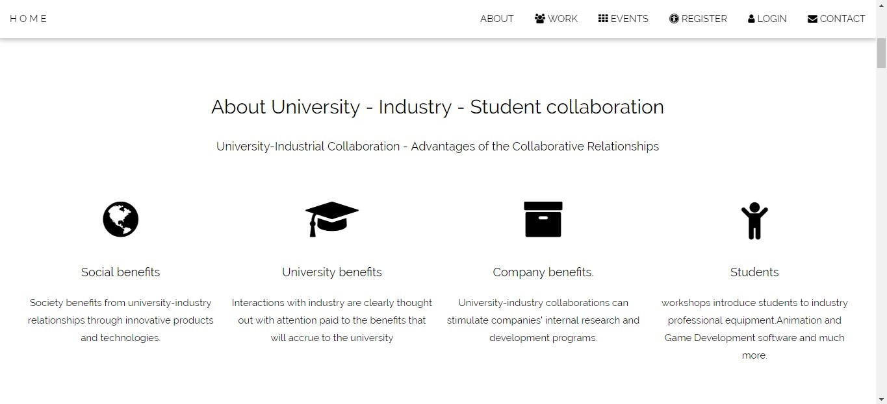
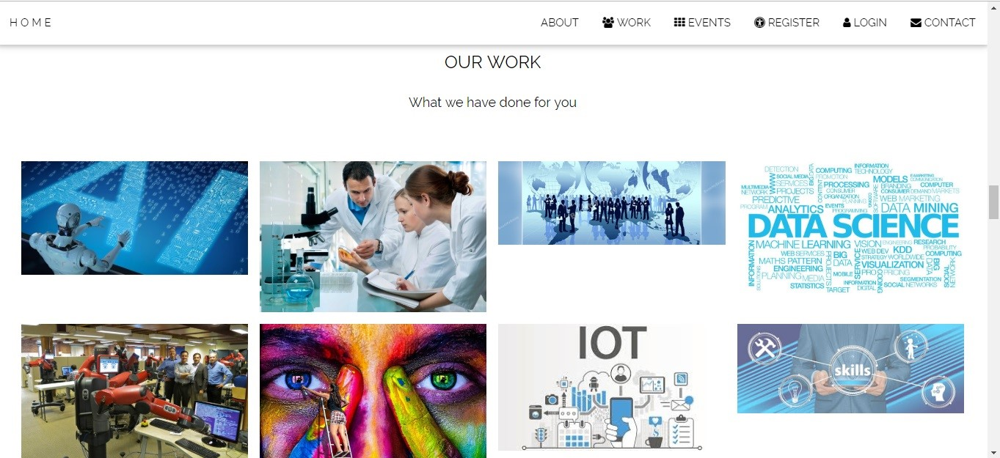
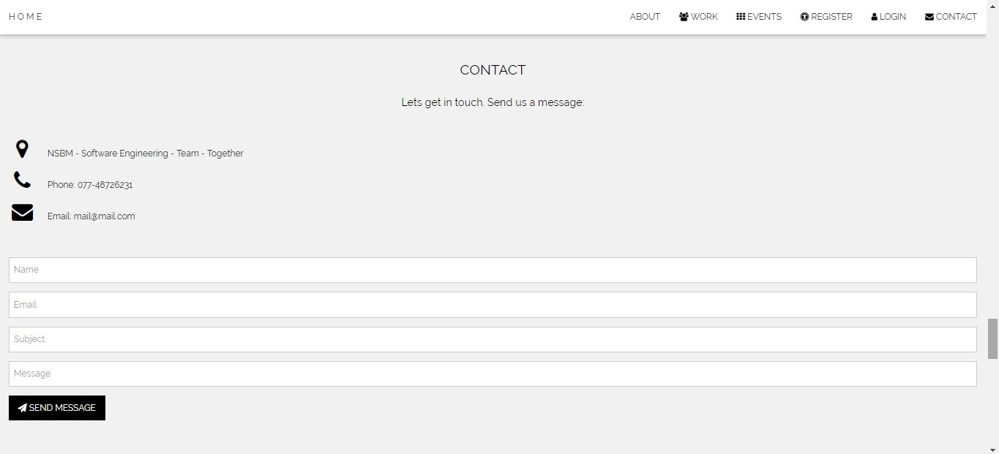
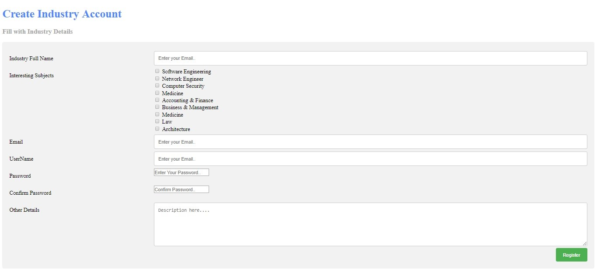

# Universities-and-Industries-Collaboration-system
Web-based application to Collaborate with Universities and industries using Java Servlet, JSP, JavaScript, Html, CSS, JDBC, MySQL.

<h2>Introduction</h2>

In Sri Lanka all the industry and university collaboration are done by traditional ad hoc manner, where it doesn’t have any specifications and common  procedures to follow.
 And the collaboration is defined within guest lectures, industry visits and workshops. Therefore, there is a very good demanded need for a system to take place which can be used easily by both the industry as well as the universities those who are seeking for opportunities. 

The system should compromise of two main portraits, one is for the industry and the other one is for the universities. Changes in above mentioned portraits should be reflected to each other in real time. 

The requirements include:

   
<ul>
<li>Manage industry login</li>
<li>Manage university login</li>
<li>Send queries to the industry from university portrait</li>
<li>Share university academic calendar and event calendar with industry </li>
<li>Post events from industry portrait</li>
<li>Make comments on posts from university portrait</li>
<li>Good looking interactive environment</li>
<li>User friendliness</li>
</ul>  
<ul>

As IT undergraduates we designed web application which connected to a database, having capabilities of all requirements.

 <h2>Problems with the existing manual system</h2>
<li>No proper indication of timing and events.</li>
<li>Some events may overlap since there is no administration.</li>
<li>Changes may not be reflected properly.</li>
<li>Some universities may not get the message on time.</li>
<li>Variation between message send and message received.</li>
</ul>  
<ul>
<h2>Expected benefits from our application</h2>
<li>All details will be saved in the database real time</li>
<li>No need to worry about the security of data</li>
<li>Easy to access and use</li>
<li>Realtime reflection on changes</li>
<li>Accuracy is very high</li>
</ul>  

<h2>Application Interfaces and How it works</h2>

<u>Main Dashboard</u>

  
 This is the main page which opens when the page loads. This has all the navigation links connected to other relevant links.

  

<u>About</u>
  

   
This area gives brief introduction to the functionalities of the web site.

<u>Work</u>

  
This describes the works that have been done by the university industry collaboration in form of pictures.

<u>Events</u>

  
This area is displaying all the events available and redirections to relevant logins and sign – ups.

  

<u>Contact</u>
  

   
Contact details of the developers are displayed under this category.

<u>Register</u>

   
This division shows links to different registration categories.

   

<u>Student Registration Form</u>

  

<u>University Registration Form</u>
  

<u>Industry Registration Form</u>

 
   

<u>Login Page</u>

  
 This page is used by all the users for their login. They just need to select the user type to redirect towards their own login category.
If user type is;

   <ul>
  <li>Student – Student Home Page</li>
  <li>University – University Home Page</li>
  <li>Industry – Industry Home Page</li>
  <li>Administrator – Administrator Home Page</li>
</ul>  
  

<u>Student Home Page</u>
  

<u>University Home Page</u>

By filling required fields in this form universities can post an university event by selecting target universities and subject

<u>University Event Form</u>

   
By filling required fields in this form universities can post an university event by selecting target universities and subject areas.

  

<u>Industry Home Page</u>
  

<u>Industry Event Form</u>

   
By filling required fields in this form industry can post an industrial event by selecting universities and subject areas.

   
   

<u>Main Dashboard</u>

  

<u>Administration Home Page</u>
  

   
This displays all the registered universities and industries with the system.

<u>University Registration by Administrator</u>

   
Administrator can create accounts for the universities if they asked to do so.

   

<u>Industry Registration by Administrator</u>

   
Administrator can create accounts for the industry if they asked to do so.

  

<u>Comment Area for the events</u>
  

Users can add the comments on each and every event posted by either by industries or by universities. This will be used as an evaluation feedback about the event conducted but it is not compulsory to fill and add a comment.

All the comments that are posted will be displayed in tabular format as displayed in the screen shot above.

Note:

Following two images will be commonly displayed for all universities, industries and students when clicked on links provided

     
